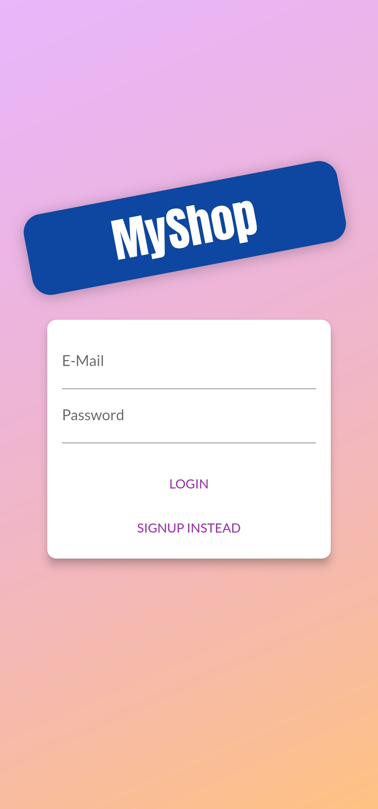
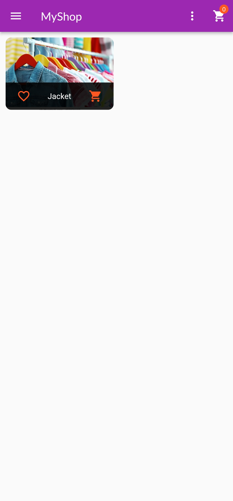
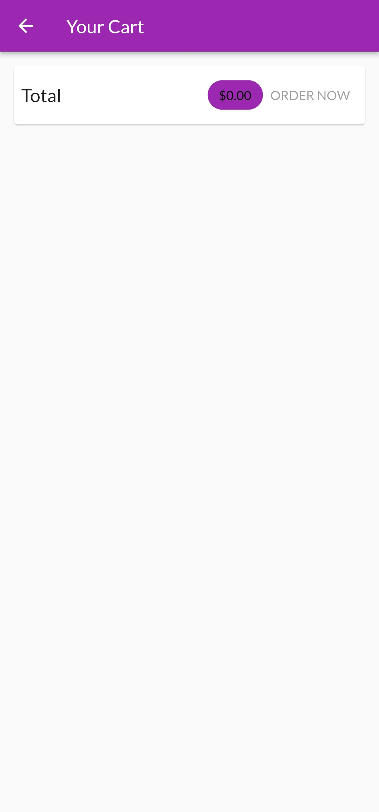
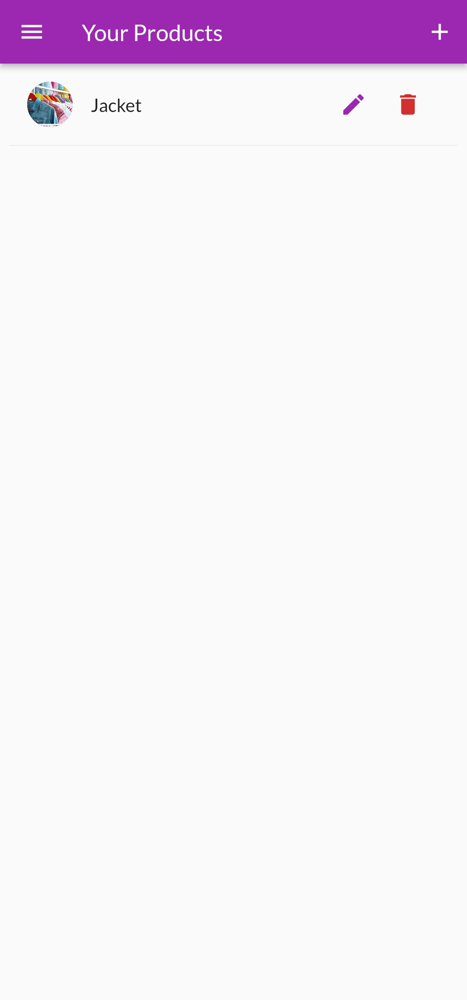

# Shop App 
- Built a mobile shopping app using Flutter, Dart, and Provider that allows users to browse and purchase products from multiple vendors.
- Implemented features such as a product catalog, a shopping cart, and a checkout process, and integrated the app with Firebase for authentication and backend functionality.
- Features - Sort, Search, and Filters.

## Screenshots

|     |     |    |    |
| :-: | :-: |:-: |:-: |
|  Auth Screen | Home Screen | Cart Screen | Edit Todo |
|  |  |   | 

<!-- ## Auth Screen

## Home Page

  
## Order Screen

 -->
